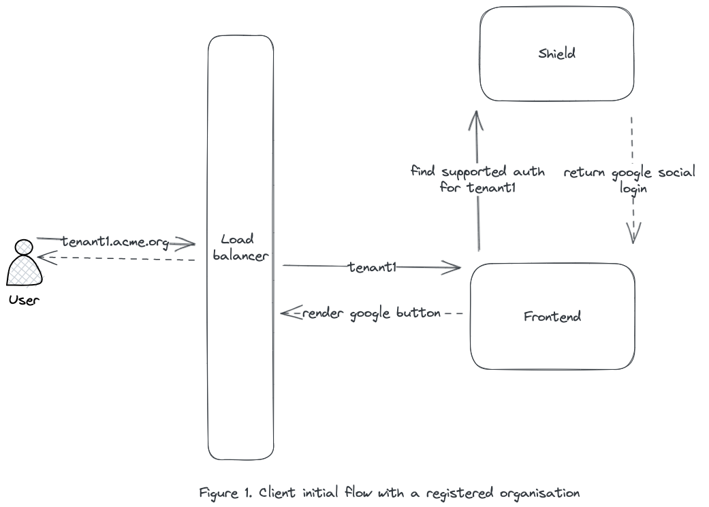
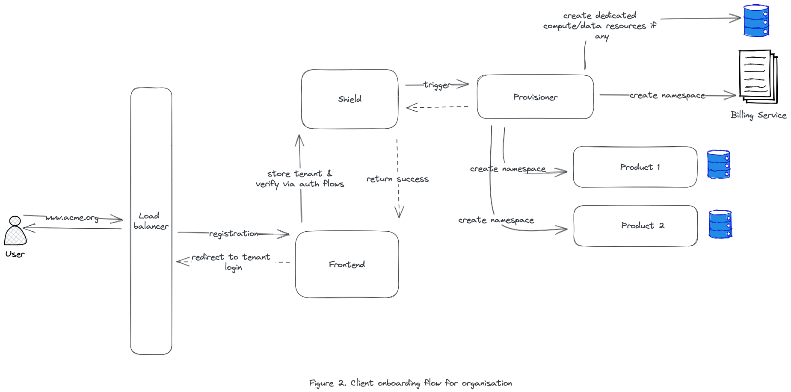
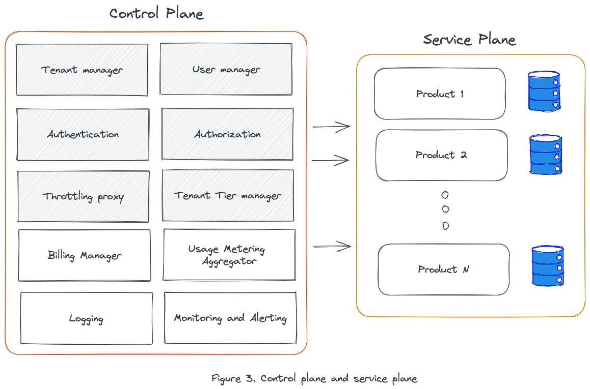
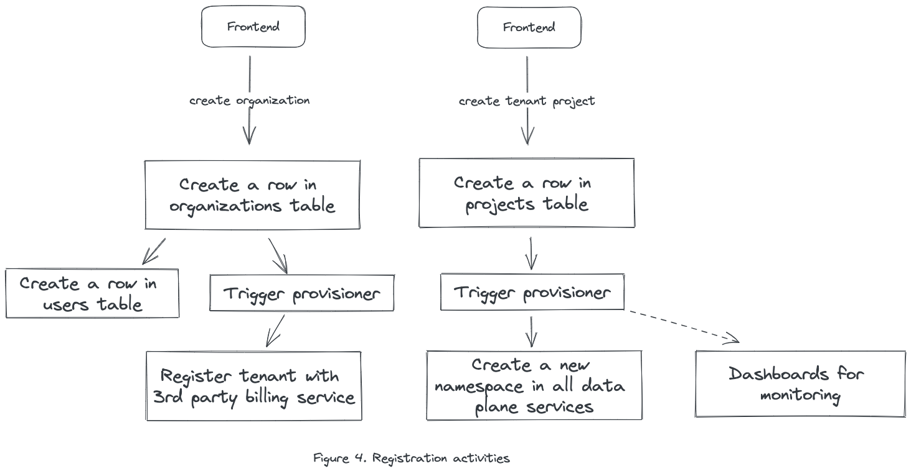
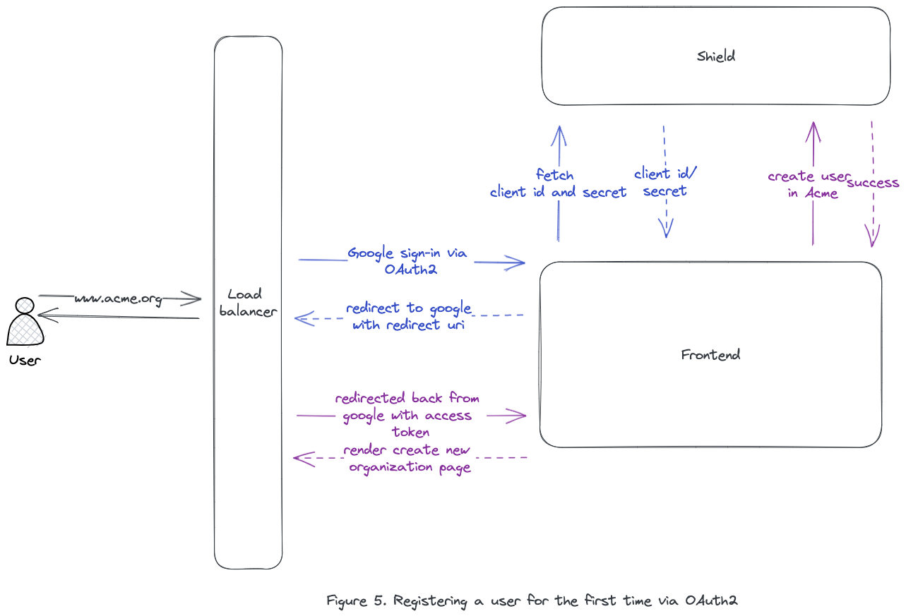
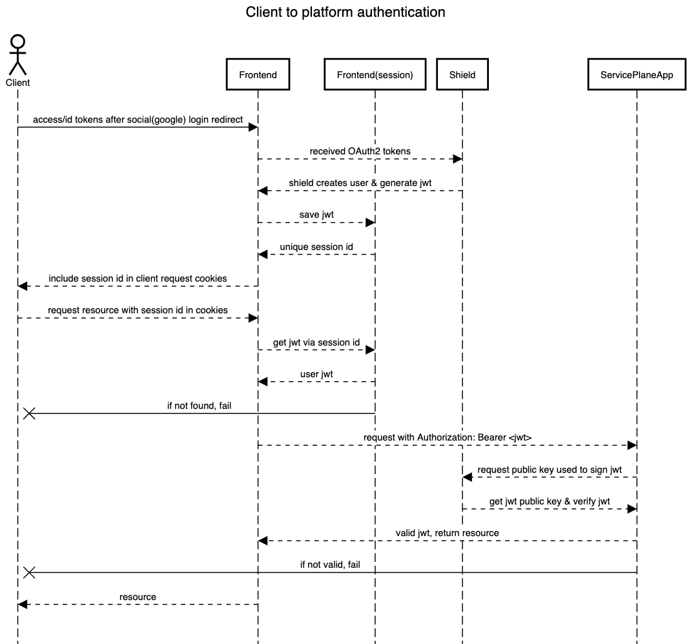
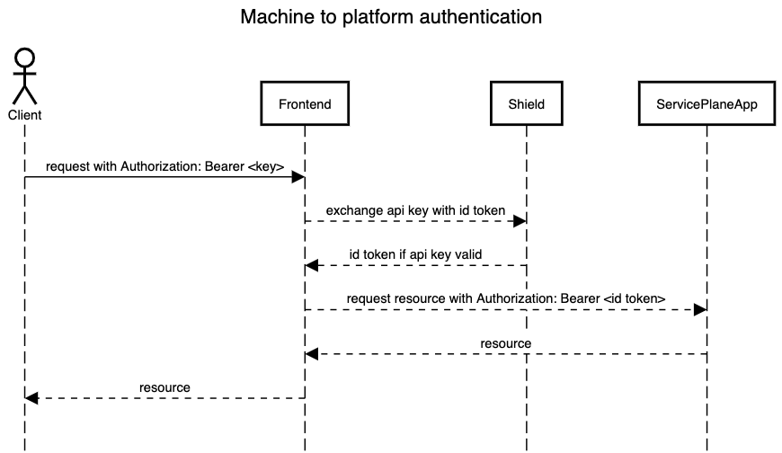
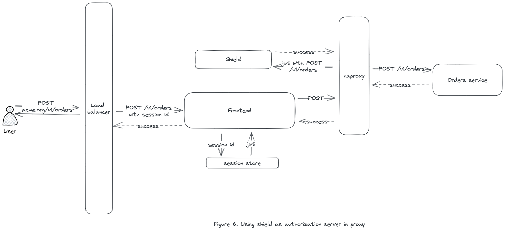
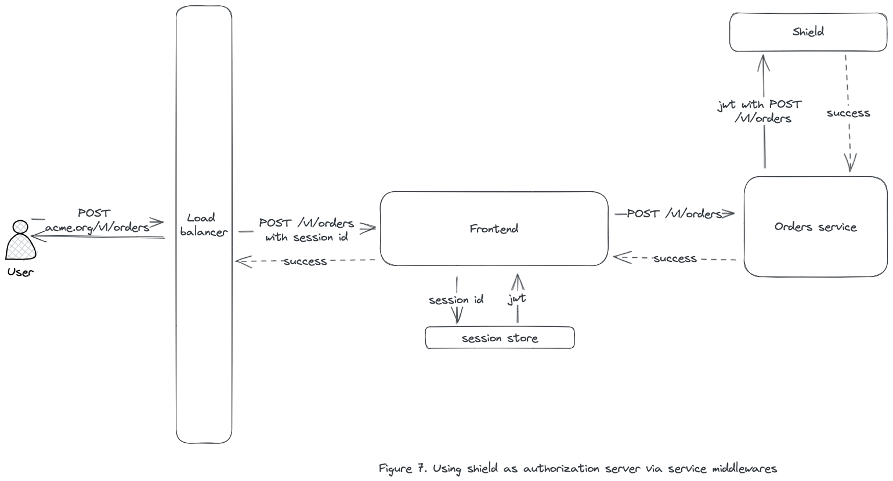
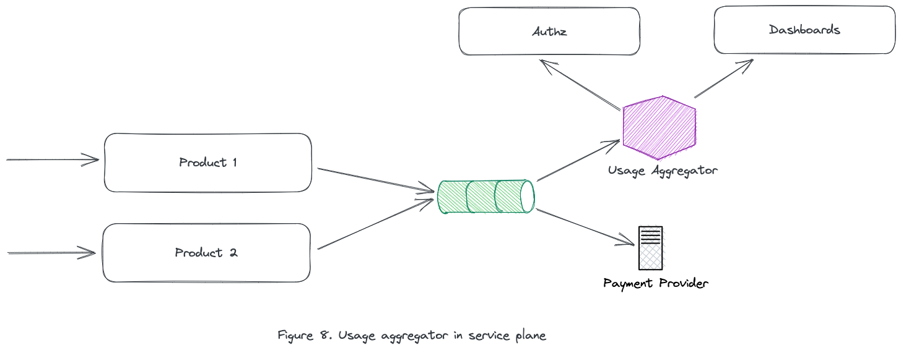

# SaaS multi-tenancy blueprint

Software as a Service (SaaS) has revolutionized the way companies approach software deployment and management. Instead of purchasing and maintaining software applications on their infrastructure, organizations can now access powerful software solutions via the cloud. However, with the rise of SaaS comes the challenge of supporting multiple customers, each with unique requirements and data. Multi-tenancy is a critical concept in SaaS that enables providers to serve multiple customers with a single instance of the software. We will explore a basic blueprint that covers different aspects of multi-tenancy, including resource isolation, control plane, and service plane, and how it enables SaaS providers to deliver secure and efficient services to customers.

To understand multi-tenancy in SaaS, it is essential to first grasp the basic request flow. When a customer initiates a request, it travels through various layers of the platform before reaching the desired destination. Typically, the request begins by passing through a load balancer, which distributes the load evenly across multiple instances of the software to ensure high availability and scalability. Next, the request goes through an authentication and authorization process, where the user's credentials are validated, and permissions are checked to ensure they have the necessary access to perform the desired action. Once the request is authenticated, it is passed on to the appropriate data plane, where the actual processing takes place. This entire process is orchestrated by the control plane, which manages the overall operation of the SaaS platform.

This sounds nice and easy but let's add more details to exactly how the flow will execute when a user opens the platform.



1.  The client loads the SaaS website and is presented with a UX where we need to somehow pass or infer the tenant details, this could be done via a subdomain like tenant1.acme.org or a text field that asks for user email and email id provider used to get the respective parent tenant/organization.
2.  The tenant name is passed to a tenant management service, in our case we are demonstrating it via **Shield**, through a load balancer which is for now only terminating the TLS connection and a frontend service used as a middleman. Shield will hold records for all the registered tenants and their metadata. Metadata will be used to list supported authentication methods of the tenant and rendered back in Frontend to the client.

This flow is based on the assumption that a tenant/org is already registered with the SaaS application. If this is the first time a user is onboarding to the SaaS platform, the initial steps would be different.



1.  Client starts by filling out a general registration form providing the tenant's name and other metadata. These details need to be managed by a tenant manager, in the current case it's **Shield**.
2.  During registration, an authentication service(**Shield**) should need to support at least following:
    1.  Email magic link: Send a link with a unique random string as params to the user on email and request the user to visit the link to verify the user via its provided email.
    2.  Social OAuth2: Utilise Google/Github sign-in OAuth2 flows by registering yourself on this platform, creating OAuth applications, generating client identifier and secret, and performing a 3-way auth handshake to get access token. This access token can be further utilized to request user metadata.
3.  A new tenant row is added to the tenant manager's(**Shield)** database and a new user as **admin** is created in the user manager(**Shield)**. The user is attached to this tenant as a member.
4.  It will trigger a provisioner in our control plane to initiate all the activities required to support a new tenant. Provisioner as a service will send requests as a superuser(with all privileges) to:
    1.  Register a new tenant in all the product/business applications in the service plane.
    2.  Register a new tenant in billing applications like Stripe.
    3.  Spin up new resources if required which will be dedicated to this tenant, it could be compute or data.
5.  After successful acknowledgment from Provisioner, **Shield** will create a JSON web token containing user and tenant details to pass it back to **Frontend** and let it store in the client session.

All of our applications are divided into two planes, the control plane, and the service plane:



A control plane will be deployed to manage items in the service plane. Based on the use case items in the service plane can be deployed once per tenant or shared across all tenants. It's a good practice to start items in a service plane shared and split them into individual tenants based on things like tenant tiers, for example, if a tenant doesn't want to share their data at all, maybe they want to pay a premium to avoid noisy neighbors, etc.

## Control Plane

### Tenant/User Management

Organizing tenants can vary based on how flexible clients need to be but ideally, a tenant should be able to create a high-level entity normally known as an **organization** and add multiple **projects** under it. This is similar to Google Cloud Platform design where billing and user pools are defined at the organization level but clients can define multiple projects under the same hierarchy. All the application services offered by the SaaS platform will be attached to a project. For example, clients can create a project for development and another for the production environment. Each of these projects will work as a unique namespace across all of our data planes. That means to use the SaaS platform, first an organization must be created, then at least a project.



We are assuming services in the data plane may contain shared compute and shared data. Managing shared compute is easy as long as we are not too worried about one tenant hogging up all of the CPU/RAM resources of the machine but to manage shared data, an isolation strategy is required.

Data isolation will require uniquely identifying each request with its parent tenant and in some cases, a bootstrapping step might need to be executed to prepare the application for future calls.

For example, if a single database is shared with all tenants (which is a good strategy to keep maintenance & cost low), a new table with project details can be created. When we are talking about a project in the data plane, I'll be using **namespace** as a term to uniquely identify a tenant. Applications don't have to care if multiple projects belong to the same tenant, each project is a unique namespace and the application should treat each namespace in isolation. During the bootstrapping phase, a new row in the namespace table can be added to store metadata related to application-specific restrictions for the tenant tier.

A user is also created by default with admin permissions that can modify how the organization/projects can behave. This user will be attached to the organization although the client should be allowed to group users into user pools and attach them to the base organization as well.

### Authentication

Authentication is a two-part problem, one where we need to keep track of all the organization admins which will be the SaaS platform's direct clients, and the other where organizations should be allowed to manage what authentication strategies should be allowed to onboard their users.

Handling the first part of the problem is easy, to keep this guide simple, start with supporting Email magic link and Google OAuth2. Create a new organization in **Shield**(for example Acme), create a project as **acme-production**, and configure Google OAuth2 social login. Google OAuth2 will need a **client id** and **secret**, this can be obtained by [registering](https://developers.google.com/identity/protocols/oauth2) a new application in Google Cloud Platform with Acme details.

When a new tenant registers for the first time on this platform, it will be created as a user in Acme organization as well as be presented a screen to create its organization inside a **Shield**. That means our platform is utilizing Shield to manage a parent organization(Acme) and all of the client's organizations. The same flow can be used by clients to configure their authentication strategies.

After successful authentication, the client's id token if passed by an issuer(GCP) can be used to extract user details otherwise access token can be utilized to fetch the user's first name, last name, profile photo, etc and create a new user account inside Shield's Acme organization.



Once the client is added to Acme organization, it will be presented with a screen to add details related to an organization/tenant for which it will be interacting, for example, new organization name/slug, for this guide we can use **Tenantx** as the slug and It will trigger the flow discussed in Figure 4.

During user registration Shield will also generate a json web token, JWT for short, containing

1.  Username
2.  User uuid
3.  Tenant uuid
4.  Tenant Tier(basic, silver, platinum)
5.  User role
6.  Extra JWT-related details like expiry, issuer, etc



This jwt will be returned to **Frontend** which will maintain it in a client browser session. In all subsequent requests, jwt can be utilized for validating if the request is authenticated in the services of the control plane & service plane. Shield has to work as an OIDC auth server for generating the jwt token & exposing jwt public keys for validating it. Generated jwt will be an access token but may not be required to be exposed to the client. All the requests hitting the frontend server can simply enrich the user request with `Authorization: Bearer <jwt token>` and let it pass to backend services.



To provide machine authentication, Shield can generate API keys at the organization level or personal access tokens to simulate clients. Unlike jwt token, the key itself doesn't contain any actual data, it is simply an opaque unique string associated with the client. Keys need to be persisted in the database as hashed values because anyone that holds a key can imitate a client. The client machine will send the key in the `Authorization` header to the frontend, the frontend should exchange the API key with an access token and the token will be passed in the header to all subsequent backend services. Shield should allow expiring registered API keys.

### Authorization

Once authentication is done, each request within the platform will be attached to its tenant identity. There are two ways a request can be authorized before the data plane can execute.

**Authorization proxy** works by intercepting each request, extracting the called route and action, and validating if the user is allowed to act. If allowed, the request is reverse proxied to the data plane or else denied. Extracting called routes is easy if the API is REST-based but could be difficult for protocols like gRPC. In the current design, Shield can act as a reverse proxy that holds configurations of each backend microservice matching user access with the requested route. Another alternative is creating a middleware in an existing implementation of reverse proxies like nginx/trafiek/envoy that intercepts the requests, extracts required details, hits shield for validation, and acts as allow or deny. Shield needs to be supplied with a ruleset for proxied services that lists what user role is allowed to access what routes.

```yaml
- service: orders_aggregator
  routes:
    viewer:
      - "GET /v1/orders/*"
    editor:
      - "POST /v1/orders/*"
      - "PUT /v1/orders/*"
    owner:
      - "* *"
```



**Service level check** gets applied when the request is received by the microservice with tenant context. One advantage of this approach is even in gRPCs, the application will be able to deserialize the request easily, pass a validation check to Shield for verifying if a user is allowed to act, and then do allow/deny. Each service will have to handle this logic either as a router middleware or a request pre-requisite.



Applications can choose to skip the validation for non-essential routes like GET if needed to avoid doing a round trip with the authz server.

### Tenant Tier management

Not all tenants may be treated as same, some might be paying a premium and expect premium services in return. SaaS platforms sell a variety of plans starting from basic/free to platinum/enterprise increasing in cost and feature expectations. There are various aspects to segregate tenants based on Service Level Agreements for availability, latency, request allowed throughput, data/compute security and isolation, customer support, and features per product.

When a tenant is registered, the tenant tier level is also mapped which will be passed along in the jwt token as tenant context. Shield in the current design handles tenant registration and metadata. Tenant segregation as discussed could be on multiple levels but there are a few essential items that should be handled on the first day.

1.  Throttling of client requests based on tier is needed to avoid one client eating up all the resources of the platform. A proxy will extracts tenant context, keeps tenant utilization in memory based on TPS, and should choose to deny requests on overutilization.
2.  Application can choose to authorize a set of features only to a tenant if they have subscribed to selected tiers. This could be handled by existing authorization logic.
3.  Restrictions on storage or compute based on utilization metrics emitted by systems.

The authorization server not only limits application routes, but should also have tenant-level utilization checks to allow or deny requests.

### Usage metering aggregator

As the applications are used, each tenant can impose a different level of usage pattern. The platform needs to track application usage by the tenant for accounting charges on demand. Although it's a lot easier to offload payment and metering details to a third-party service like Stripe, it's still better to aggregate these events in the control plane.

An aggregator service can be used to keep audit logs and answer questions about denying tenants with resource overutilization. Each service from the service plane will use a platform library to emit metrics, and an event may contain

- tenant-id e.g. `uuid`
- tenant tier e.g. `platinum`
- resource utilization metric e.g. `storage:{}, execution_time:{}`
- resource-id e.g. `orders`



The reason to keep events enriched with tenant tier is that it allows dashboards to filter utilization without calling an external service. Events from the service will eventually be sent to third-party payment providers for tracking the cost. If your costs are fixed, that is, they don’t change with fluctuations in customer usage, then it might not be very useful.

## Service Plane

### Runtime data isolation

Isolation across tenants to restrict clients' access only to their resources is a minimum requirement for a multi-tenant SaaS platform. Isolation varies based on the use case, it could be at compute level, at the data level, isolation via multiple deployed resources, or via shared resources. For now, the discussion is limited to runtime isolation when data is shared within a single product.

An easy approach that we can start with is using filters while querying the data from databases. Each request hitting service will be injected with tenant context. Tenant context or `uuid` can be used as part of the `where` clause if a SQL statement is used for execution. For example

```sql
Select * from orders where namespace_id = {tenant_id};
```

Each query fired from this service needs to strictly make sure a `where` clause is correctly applied because if it fails to do so, queries can cross-access tenant orders. It's a high cost to pay and too much trust in developer effectiveness over unit and integration tests. There should be a better strategy that works above our query pattern to avoid falling into these traps.

**Postgres** provides [Row Level Security](https://www.postgresql.org/docs/current/ddl-rowsecurity.html) as great runtime isolation strategy. To specify which rows are visible or modifiable, an expression is required that returns a Boolean result. This expression will be evaluated for each row before any conditions or functions come from the client's query. An expression that matches "client injected tenant id" with the "tenant id available in the table" is used to filter only rows that belong to the tenant.

First, enable RLS over all the tables in the database

```sql
ALTER TABLE orders ENABLE ROW LEVEL SECURITY;
DROP POLICY IF EXISTS orders_isolation_policy ON orders;
```

Create a policy that matches the value in column `namespace_id` with a connection variable set using client context.

```sql
CREATE POLICY orders_isolation_policy on orders
USING (namespace_id = current_setting('app.current_tenant')::UUID);
```

Whenever a query is fired from the application, get a new connection from the pool and run `SET app.current_tenant = 'namespace uuid of current tenant'`
This variable value will be valid till the connection is alive, so after the application is done executing the query, it is necessary to reset the variable via `RESET app.current_tenant`. This ensures whenever the connection is pushed back into the pool for recycling, the previous tenant context is not leaked.

```go
func Connection(ctx context.Context, sqlDB *sqlx.DB, fc func(*sql.Conn) error) error {
    conn, err := sqlDB.Conn(ctx)
    if err != nil {
        return err
    }
    defer conn.Close()

    // inject context
    namespaceID := ctx.Value("namespace_id").(string)	
    if _, err := conn.ExecContext(ctx, "SET app.current_tenant = '?'", namespaceID); err != nil {
        return err
    }
    
    // execute base query
    baseErr := fc(conn)
    
    // reset context
    if _, err := conn.ExecContext(ctx, "RESET app.current_tenant"); err != nil {
        return err
    }
    return baseErr
}
```

Make sure the user used in the application to establish the connection with the database instance is not a `superuser`, not the table `owner`, and was not created using `BYPASSRLS` as by default it ignores RLS rules.

In **ElasticSearch**, aliases can be utilized to route tenant read/write requests to specific shards, this helps limit es compute operation limit itself to just 1 shard but while querying it is still needed a filter with the tenant id because the same shard could have other tenant's data as well. This creates run time isolation that ensures all the search/index queries don't have to worry about filtering and we can [fake unique indexes](https://www.elastic.co/guide/en/elasticsearch/guide/current/faking-it.html) for each tenant.

```json
{
    "actions": [
        {
            "remove": {
                "alias": "{{alias_name}}",
                "index": "shared-index"
            }
        },
        {
            "add": {
                "index": "shared-index",
                "alias": "{{alias_name}}",
                "filter": {
                    "term": {
                        "namespace_id": "{{filter_id}}"
                    }
                },
                "index_routing": "{{write_id}}",
                "search_routing": "{{read_id}}"
            }
        }
    ]
}
```

Each document should contain a field `namespace_id` during insert marked as a keyword. Do note, this is a good strategy for small-scale tenants but for large enterprise customers, we can create a dedicated index per tenant although there would be very minimal change in our aliasing strategy.

**Kubernetes** supports tenant isolation from the ground up via namespaces. Namespaces work as isolation groups within a cluster. Each tenant can have its own Kubernetes namespace.

The idea is to decompose each service based on its load and isolation profile and limit dependency on developer filtering.

### Application libraries

Limit developer awareness of multi-tenant concepts by extracting tenant-specific code to libraries.

1.  A middleware for HTTP routers that validates tenant identity by extracting tokens from headers.
2.  A token manager that parses header, and extracts tenant profile that can be passed in application context for uses like database connections.
3.  Logging helpers that injects tenant profile as part of application logs
4.  Metric helpers that inject tenant profiles with application-specific telemetry.

We have skipped a couple of discussion topics like CI/CD pipelines, managing multiple codebases if the products are open core, etc. In conclusion, SaaS multi-tenancy has become an essential concept in the world of software development, allowing companies to efficiently manage and serve multiple tenants on a shared infrastructure. 